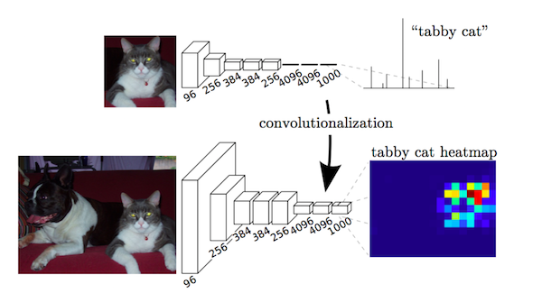

# Fully Convolutional Networks for Semantic Segmentation
> Submitted on 14 Nov 2014
  [Arxiv Link](https://arxiv.org/abs/1411.4038)

## Key Contribution
- Popularize the use of end to end convolutional networks for semantic segmentation
- Re-purpose ImageNet pretrained networks for segmantation
- Upsample using deconvolutional (Transpose convolution) layers
- Introduce skip connections to improve over the coarseness of upsampling

## Architecture

## Explanation
Key observation is that fully connected layers in classification networks can be viewed as **convolutions with kernels that cover their entire input regions**. This is equivalent to evaluating the original classification network on overlapping input patches but is much more efficient because computation is shared over the overlapping regions of patches.

After convolutionalizing fully connected layers in a ImageNet pretrained network like VGG, feature maps still need to be upsampled because of pooling operations in CNNs. Instead of using simple bilinear interpolation, deconvolutional layers can learn the interpolation. This layer is also known as *upconvolution*,*transposed convolution*.

However, upsampling produces coarse segmentaion maps because of loss of information during pooling. Therefore, short cut/skip connections are introduced from higher resolution feature maps.