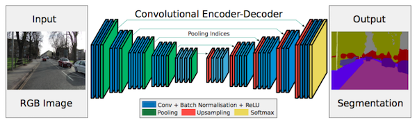

# SegNet: A Deep Convolutional Encoder-Decoder Architecture for Image Segmentation
>Submitted on 2 Nov 2015
>[Arxiv Link](https://arxiv.org/abs/1511.00561)

## Key Contribution
- Maxpooling indices transferred to decoder to improve the segmentation resolution

## Architecture

## Explanation
More short cut connections are introduced. Hoever, instead of copying the encoder features as in FCN, indices from max pooling are copied. This makes SegNet more memory efficient than FCN.
